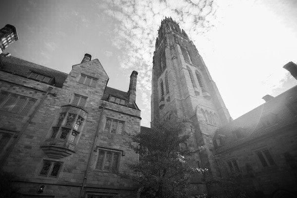
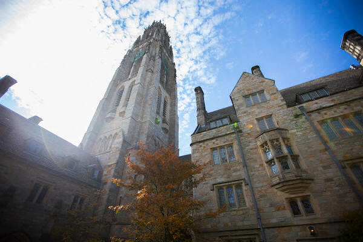
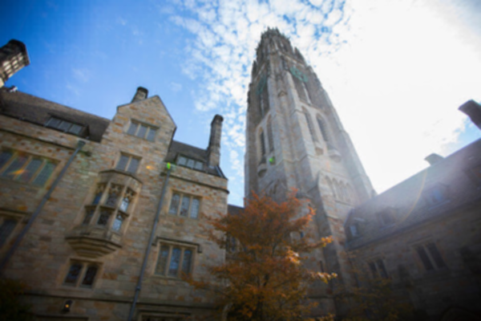
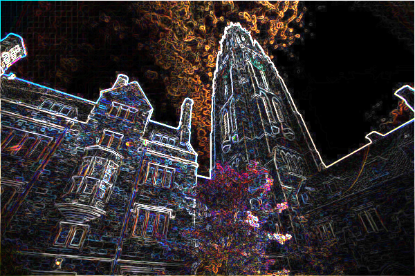
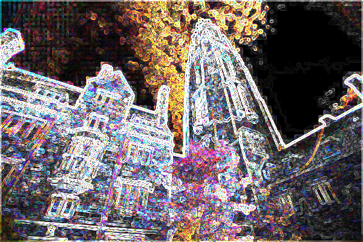
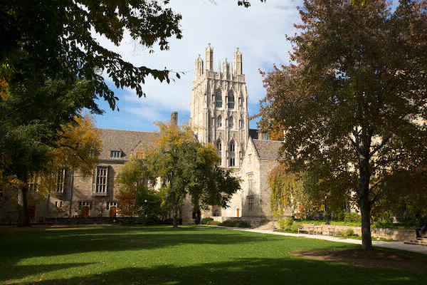
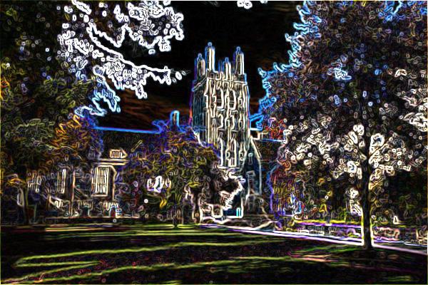
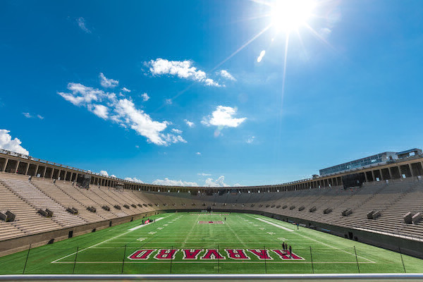
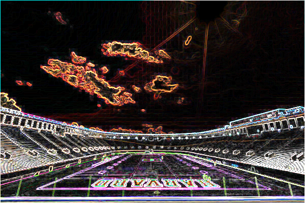

# 📂 Week 4 — Filter (More) - Problem Set

Implementation of image filters in C for CS50’s Week 4 problem set.
The program applies transformations such as grayscale, reflect, blur, and edge detection to BMP images.

---

## 📂 Files

* [`filter.c`](./filter.c) — main program to compile and run filters
* [`helpers.c`](./helpers.c) — filter functions implementation
* [`helpers.h`](./helpers.h) — function prototypes
* [`bmp.h`](./bmp.h) — BMP image structure definition (provided by CS50)
* [`Makefile`](./Makefile) — build instructions

---

## 🖼️ Image Results

Input images are stored in `images-original/`.
Filtered results are organized by folders:

* [`images-original/`](./images-original) — original BMP files
* [`images-grayscale/`](./images-grayscale) — grayscale transformation
* [`images-reflect/`](./images-reflect) — horizontal reflection
* [`images-blur/`](./images-blur) — blur filter
* [`images-edges/`](./images-edges) — edge detection filter
* [`images-edges-2x/`](./images-edges-2x) — edge detection applied twice
* [`images-blur-and-edges/`](./images-blur-and-edges) — experimental combinations (blur + edges)

Example filenames:

* `tower-edges.bmp` → tower with edge detection
* `tower-edges-2x.bmp` → edge detection applied twice
* `courtyard-blur-and-edges.bmp` → courtyard blurred and edge detected
* `stadium-grayscale.bmp` → stadium in grayscale

---

## 🖼️ Showcase

Here are representative results converted to `.png` for quick viewing:

### Example: Tower.bmp

| Original                           | Grayscale                           | Reflect                           |
| ---------------------------------- | ----------------------------------- | --------------------------------- |
|  |  |  |

| Blur                           | Edges                           | Edges 2x                           |
| ------------------------------ | ------------------------------- | ---------------------------------- |
|  |  |  |

### Example: Courtyard.bmp (Blur + Edges)

| Original                               | Blur + Edges                                 |
| -------------------------------------- | -------------------------------------------- |
|  |  |

### Extra Example: Stadium.bmp (Edges)

| Original                             | Edges                             |
| ------------------------------------ | --------------------------------- |
|  |  |

---

## 🛠️ Compilation and Execution

Compile with:

```bash
make filter
```

Run with:

```bash
./filter -g images-original/tower.bmp tower-grayscale.bmp   # grayscale
./filter -r images-original/tower.bmp tower-reflect.bmp     # reflect
./filter -b images-original/tower.bmp tower-blur.bmp        # blur
./filter -e images-original/tower.bmp tower-edges.bmp       # edges
```

Options:

* `-g` → grayscale
* `-r` → reflect
* `-b` → blur
* `-e` → edges

---

## ✅ Notes / Best Practices

* Each filter is implemented in `helpers.c`.
* The program only works with **24-bit uncompressed BMP images**.
* You can chain filters by reusing the output as input. I did this with Blur and then Edges, also with Edges twice.
* A `showcase/` folder with `.png` conversions highlights results directly on GitHub.

---

## 🔗 Resources

* [CS50 Filter (More) Specification](https://cs50.harvard.edu/x/2025/psets/4/filter/more/)

---
